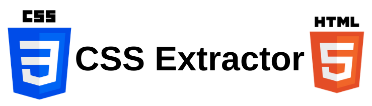

The handiest script for UI development. Copy your favorite elements from the internet and get back `HTML` and `CSS` files that you can use and modify right away. No more manually copying and pasting definitions from stylesheets.

## Installation

1. **Create a Python Virtual Environment**

You can use `conda` or something else, but this is the fastest for me.
```
python -m venv /path/to/new/virtual/environment
```

2. **Download Dependencies**

Make sure to activate your virtual environment before running!
```
pip3 install -r requirements.txt
```

## Usage

The extraction process is a 2-step process.

1. **HTML Extraction**

We first analyze the input HTML markup and create a map of old classes to new ones.

For example, if you have an HTML element like the following:
```html
<h1 class="big red slant">This is a header</h1>
```

We would generate a mapping that is JSON-encoded like this:
```json
[
{
  "newClass": "RANDOM_STRING_CLASS_NAME",
  "oldClasses": "big, red, slant"
}
]
```

And produce an output HTML file like this:
```html
<h1 class="RANDOM_STRING_CLASS_NAME">This is a header</h1>
```

2. **CSS Extraction**

The JSON file generated in the previous step is then fed into the CSS extraction process, which builds our new class with all the styles from the old classes. The output class will have the old class names annotated in the CSS as comments for debugging purposes.

```css
.RANDOM_STRING_CLASS_NAME {
    /* big */
    font-size: 50px;
    /* red */
    color: red;
    /* slant */
    font-style: italic;
}
```

> We keep this as a manual 2-step process to allow for debugging after whole process is completed. We may change this to just be a 1 step process in the future.

### HTML CSS Class Extraction

This is an example of how to run the extraction:

```bash
python3 main.py --html --input-html-file input.html --output-html-file output.html --output-json-file output.json
```

### CSS Class Extraction and Compression

```bash
python3 main.py --css --input-css-file input.css --input-json-file input.json --output-css-file output.css
```

## Why?

I enjoy building websites with raw CSS, but creating UIs with it can be difficult and frustrating. I'm also not the most creative person, and writing CSS from scratch can be tedious, so I often end up copying elements or sections of content that I find on the internet.

After years of manually extracting styles from websites I liked, I decided to create a library to automate this process. This library has saved me hours of manually reading through markup files and allows me to experiment much faster.

## How does it work?

The first iteration used regex to find and grab the CSS definitions from the desired input classes. However, this approach turned out to be problematic because CSS is complex, especially when you're dealing with `@media` queries and `pseudo-selectors`. There are still some leftover functions that use regex matching, as I didn't bother to rewrite them.

I eventually started using the `tinycss2` library, which parses CSS text into a format that can be programmatically analyzed. This is much better for handling `@media` queries and `pseudo-selectors`. This approach is a bit slow, as it involves many nested loops, and the library is not optimized for speed. Once we resolve the edge cases, we can focus on improving the program's performance.

## Caveats

- This is a very basic implementation, but it has served me well so far. There are certain edge cases that the library does not handle. For example, it struggles with nested classes (a child element within a parent element with a specific class). This nested class example will break the script.

- `Not` selectors and complex `pseudo-selectors` are also tricky and not detected. Feel free to open an issue for any bugs you encounter. If it's feasible, we'll fix them.

- The formatting of the output files is a bit janky. In the future, we can clean this up, but for now, it's easy enough to reformat CSS and HTML in a code editor or IDE.

- The tool currently only works with single files. If the CSS is split across multiple files on a website, you will have to manually combine them for the `input.css`. Similarly, if CSS is embedded in a style tag within the HTML, you'll need to extract that and place it in a separate file.

- Styling and look is heavily affected by the css reset's applied. Make sure that you're using a similar reset file. For example, if your cloning tailwind css, make sure to include the tailwind css reset. Other styling frameworks should work the same.

- If a class is not found in the input stylesheet, the library makes a best note to mark which class could not be found. this appears right after the css class defination as a comment.